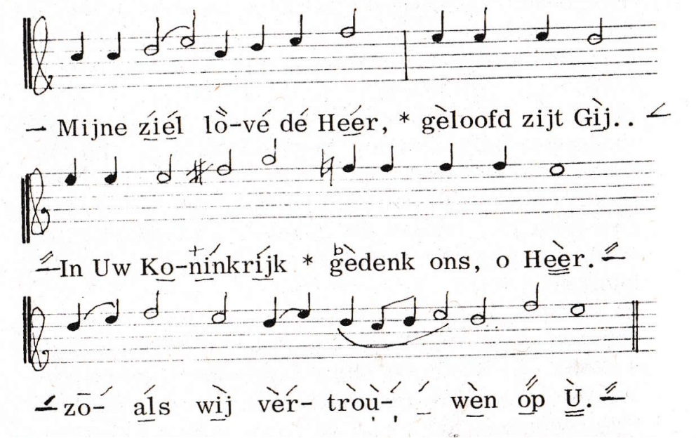

## 1. Inleiding

<!-- http://www.ivanmoody.co.uk/orthodoxliturgylinks.htm -->

De Slavisch‑orthodoxe zangtraditie kent een lange geschiedenis van **staffloze neumen­notatie**, waarvan de bekendste vorm de klassieke **Znamenny‑notatie** is. Deze notatie gebruikt ideografische tekens (*kriuki* of *znamëna*) om melodische beweging, formules en expressie vast te leggen zonder exacte toonhoogtes. Een toegankelijke introductie is te vinden op [Znamenny chant](https://en.wikipedia.org/wiki/Znamenny_chant), en een overzicht van historische notatievormen op [Znamenny musical notation](https://en.wikipedia.org/wiki/Znamenny_notation).

Hoewel deze officiële systemen rijk en complex zijn, ontstonden er in parochies ook **vereenvoudigde, mondeling overgeleverde markeersystemen**. Deze systemen — vaak bestaande uit gestapelde streepjes boven de tekst en horizontale lijnen onder syllaben — dienden als praktische hulpmiddelen om **richting**, **accent** en **duur** van de zang aan te geven. Ze zijn echter **niet gestandaardiseerd**, **niet officieel gedocumenteerd**, en verschillen per regio, koorleider of lokale traditie. [Appendix 1](#appendix-1) bevat de uitleg zoals die werd gegeven in het Nederlandse Liturgikon. 

Dit document introduceert een formele codificatie van deze praktijkgerichte notatie: de **Vereenvoudigde Slavische Accentnotatie (VSA‑notatie)**. VSA is geen vervanging van historische kriuki- of znamenny-notatie, maar een lichte, consistente en reproduceerbare manier om Slavisch‑orthodoxe congregatiezang digitaal te noteren.

Het doel is een notatie die:

- eenvoudig te leren is voor zangers zonder gespecialiseerde opleiding;
- aansluit bij bestaande parochiële praktijk;
- formeel definieerbaar is in een grammatica;
- betrouwbaar te parseren, valideren en renderen is;
- bruikbaar is in tekstgebaseerde workflows, statische websites en automatische renderers of weergavecomponenten;
- voldoende semantische informatie bevat voor conversie naar symbolische muziekformaten zoals MusicXML.

VSA beschrijft melodische beweging binnen een modaal toonstelsel waarin stapgrootten niet uniform zijn en afhankelijk zijn van de gekozen grondtoon: de `do` van de toonladder.

---

## 2. Leeswijzer

Dit document is bedoeld voor twee doelgroepen:

1. **Gebruikers van de notatie**: zij willen weten hoe VSA gelezen en geschreven wordt.
2. **Implementatoren**: zij willen VSA kunnen parsen, valideren, renderen of exporteren.

Daarom is het document opgebouwd in lagen:

| Laag                                             | Vraag                                               | Hoofdstuk |
| ------------------------------------------------ | --------------------------------------------------- | --------- |
| [Terminologie](#3-terminologie)                  | Welke begrippen worden gebruikt?                    | 3         |
| [Syntax](#4-syntax)                              | Wat mag er letterlijk in de tekst staan?            | 4         |
| [Semantiek](#5-semantiek)                        | Wat betekent de notatie muzikaal?                   | 5         |
| [Validatie](#6-validatie-en-fouten)              | Welke fouten kunnen optreden?                       | 6         |
| [Abstract model](#7-abstract-implementatiemodel) | Hoe kan een implementatie VSA intern representeren? | 7         |
| [Rendering/export](#8-rendering-en-export)       | Hoe wordt VSA weergegeven of geconverteerd?         | 8         |
| [Voorbeelden](#9-voorbeelden)                    | Hoe ziet VSA er in gebruik uit?                     | 9         |

Belangrijke scheiding:

- **Syntax** bepaalt of een tekst grammaticaal geldig is.
- **Semantiek** bepaalt of een grammaticaal geldige tekst muzikaal betekenisvol is.
- **Rendering/export** bepaalt hoe een gevalideerd zangstuk wordt weergegeven of geconverteerd.

---

## 3. Terminologie

| Term                   | Betekenis                                                                                                                                                           |
| ---------------------- | ------------------------------------------------------------------------------------------------------------------------------------------------------------------- |
| AST                    | Abstract Syntax Tree. Een interne boom- of objectstructuur die het resultaat is van parsing.                                                                        |
| Absolute toonhoogte    | Een expliciete toonhoogteaanduiding voor interpretatie of export, bijvoorbeeld `C4` of `F#3`; dit hoort in blokmetadata, niet in een toonhoogte-markering.          |
| Blok                   | zie: Hugo markdown blok                                                                                                                                             |           
| Do-context             | De grondtooncontext waarbinnen relatieve toonhoogtebewegingen worden geïnterpreteerd. De do-context bestaat uit de grondtoon (`do`) en de modus                     |
| Duur                   | Interne representatie van de duur van een muzikale positie.                                                                                                         |
| EHM                    | Enkelvoudige Hoogte-Modifier. Een elementaire hoogte-instructie zoals `/`, `\\`, `+/`, `-\\`, `-` of `~`.                                                           |
| ELM                    | Enkelvoudige Lengte-Modifier. Een elementaire duurinstructie zoals `_`, `__`, `.`, `..`, `-` of `~`.                                                                |
| Export                 | Het omzetten van gevalideerde VSA-notatie naar een extern formaat zoals MusicXML.                                                                                   |
| Glyph                  | De grafische representatie van een EHM of ELM.                                                                                                                      |
| Grid                   | Het renderobject voor één zangelement-scope. Het bestaat uit een bovenrij, tekstlaag en onderrij.                                                                   |
| Hoogte-modifier        | Een rij EHMs die melodische beweging specificeert.                                                                                                                  |
| Hugo markdown blok     | De tekst `::: vsa-notatie`, gevolgd door een lijst van parameters, een zangstuk, en `:::`                                                                           |
| Kolom                  | De grafische representatie van één muzikale positie binnen een grid.                                                                                                |
| Ladderstap             | Een overgang van één toonladdergraad naar de volgende of vorige graad.                                                                                              |
| Lengte-modifier        | Een rij ELMs die de duur van muzikale posities specificeert.                                                                                                        |
| Mappingstrategie       | De implementatiekeuze waarmee relatieve toonladderbewegingen worden omgezet naar concrete toonhoogten.                                                              |
| Melisma                | Het zingen van één zangelement over meerdere opeenvolgende muzikale posities.                                                                                       |
| Modus                  | De intervalstructuur van een toonladder. De modus bepaalt welke overgangen grote of kleine stappen zijn. Voorbeelden zijn 'majeur' en 'mineur'.                     |
| Modifier               | Verzamelnaam voor een hoogte-modifier of lengte-modifier.                                                                                                           |
| Muzikale positie       | De kleinste muzikale eenheid binnen een zangstuk. Een muzikale positie representeert precies één gezongen toon met een relatieve toonhoogte en een duur.            |
| Muzikale tijdlijn      | De geordende reeks muzikale posities van een zangstuk.                                                                                                              |
| Node                   | Een element binnen een AST-structuur.                                                                                                                               |
| Parser                 | Een component die VSA-tekst omzet naar een AST of andere interne representatie.                                                                                     |
| Toonhoogte             | Interne representatie van een concrete toonhoogte.                                                                                                                  |
| PitchMarkerNode        | AST-node die een toonhoogte-markering representeert; deze bevat geen absolute toonhoogte.                                                                           |
| Positie                | Verkorte schrijfwijze voor muzikale positie.                                                                                                                        |
| Renderen               | Het omzetten van gevalideerde VSA-notatie naar een visuele of symbolische representatie zoals SVG, HTML, PDF of MusicXML.                                           |
| Renderlaag             | Eén van de drie visuele lagen van een rendering: bovenlaag, tekstlaag of onderlaag.                                                                                 |
| Samengestelde modifier | Een modifier die uit meerdere EHMs of ELMs bestaat, gescheiden door `&`.                                                                                            |
| Scope                  | Verkorte schrijfwijze voor zangelement-scope.                                                                                                                       |
| ScopeNode              | AST-node die een zangelement-scope representeert.                                                                                                                   |
| Semantische validatie  | Controle of syntactisch geldige VSA-notatie ook voldoet aan de betekenisregels van VSA.                                                                             |
| Standaardduur          | De basisduur van een muzikale positie waarvan alle ELM-duurwaarden worden afgeleid.                                                                                 |
| Syntax-validatie       | Controle of invoer voldoet aan de grammaticale regels van VSA.                                                                                                      |
| Toonhoogte-markering   | Een speciale constructie aan het begin of einde van een zangstuk waarmee een een relatieve hoogte-modifier worden vastgelegd.                                       |
| Toonhoogtebeweging     | Een relatieve verandering van toonhoogte zoals beschreven door een EHM.                                                                                             |
| Toonladdergraad        | Een positie binnen de toonladder, bijvoorbeeld `do`, `re`, `mi`, `fa`, `sol`, `la`, `ti`.                                                                           |
| VSA-markering          | Iedere syntactische constructie waarmee muzikale informatie aan tekst wordt gekoppeld, zoals scopes, modifiers en toonhoogte-markeringen.                           |
| Zangelement            | De tekst waaraan muzikale informatie wordt gekoppeld. Dit is vaak een lettergreep, maar kan ook een kleiner of groter tekstfragment zijn.                           |
| Zangelement-scope      | Een gemarkeerd tekstdeel tussen `{` en `}`. Een scope bevat achtereenvolgens een optionele hoogte-modifier, exact één zangelement en een optionele lengte-modifier. |
| Zangstuk               | Een tekst die gezongen kan worden, zoals een tropaar of kondak, en in VSA is opgeschreven.                                                                          |

---

## 4. Syntax

### 4.1 Hugo Markdown bloksyntax

VSA-zangstukken worden beschreven in een zo genaamd `Hugo Markdown blok` (zie hoofdstuk 4.1.1. voor de formele syntax, en hoofdstuk 5 voor de semantiek). We geven hier alvast een voorbeeld:

```markdown
::: vsa-notatie
do="F4"
mode="major"
tempo="100"
validate-ending="true"
duration-model="default"

[:] {/Hei_}{/lig_} is de Heer. [//:]
:::
```

De blokparameters behoren niet tot de zichtbare VSA-notatie, maar leveren context voor validatie, rendering en export. Absolute toonhoogten, modi, tempi e.d. worden als parameters gespecificeerd, en niet in het zangstuk (in het voorbeeld: `[:] {/Hei_}{/lig_} is de Heer. [//:]`). Dit sluit aan bij de praktijk waarin alleen zangstukken op papier staan, en de eigenlijke toon waarop gezongen wordt, de modi en tempi worden aangegeven door de koorleider.

Een aantal parameters van de bloksyntax hebben normatieve defaultwaarde, wat het mogelijk maakt om blokken waarin deze parameters niet zijn gespecificeerd, toch speelbaar te maken. Het gaat om de volgende parameters:

| Parameter         | Default waarde | Betekenis                                                   |
| ----------------- | -------------- | ----------------------------------------------------------- |
| `do`              | `F4`           | absolute starttoon voor interpretatie en MusicXML-export    |
| `mode`            | `major`        | modusdefinitie voor toonladderinterpretatie                 |
| `tempo`           | `100`          | tempo voor MusicXML-export                                  |
| `validate-ending` | `true`         | controleer dat de eindtoonhoogte-markering bestaat en klopt |
| `duration-model`  | `default`      | mapping van ELM-duurwaarden naar MusicXML-durationwaarden   |

Andere parameters mogen eveneens voorkomen, bijvoorbeeld `title`, `subtitle`, `composer`, `language`, `meter`, `tone` of renderer-specifieke metadata. Zie Appendix 3 voor voorbeelden. De blokmetadata heeft voorrang op implementatie-defaults.

#### 4.1.1 EBNF voor Hugo Markdown bloksyntax

```ebnf
vsa-codeblok ::=
    "::: vsa-notatie"
    { newline parameter }
    newline
    zangstuk
    newline
    ":::" ;

parameter ::= bekende-parameter | vrije-parameter ;

bekende-parameter ::=
      do-parameter
    | mode-parameter
    | tempo-parameter
    | validate-ending-parameter
    | duration-model-parameter ;

do-parameter ::= 'do="' absolute-toonhoogte '"' ;

absolute-toonhoogte ::= toonnaam [ alteratie ] octaaf ;
toonnaam ::= "A" | "B" | "C" | "D" | "E" | "F" | "G" ;
alteratie ::= "#" | "♯" | "b" | "♭" ;
octaaf ::= "0" | "1" | "2" | "3" | "4" | "5" | "6" | "7" | "8" ;

mode-parameter ::= 'mode="' identifier '"' ;
tempo-parameter ::= 'tempo="' integer '"' ;
validate-ending-parameter ::= 'validate-ending="' boolean '"' ;
duration-model-parameter ::= 'duration-model="' identifier '"' ;

vrije-parameter ::= identifier '="' parameter-waarde '"' ;
parameter-waarde ::= ? elk Unicode-karakter behalve '"' en newline ? ;
identifier ::= ? ASCII-letter, gevolgd door ASCII-letters, cijfers of '-' ? ;
integer ::= ? één of meer cijfers ? ;
boolean ::= "true" | "false" ;
```

### 4.2 Algemene regels

Een VSA-zangstuk is gewone Unicode-tekst waarin sommige tekstfragmenten worden voorzien van VSA-markering. In een zangstuk kunnen zangelement-scopes voorkomen. Die zijn van de vorm:

```text
{<hoogte-modifier><zangelement><lengte-modifier>}
```

Daarbij geldt:

- een scope begint met `{` en eindigt met `}`;
- binnen een scope mag geen whitespace voorkomen;
- het zangelement (gezongen tekstframgment) is verplicht;
- de hoogte-modifier is optioneel;
- de lengte-modifier is optioneel;
- tekens die als modifierteken worden gebruikt, mogen niet in het zangelement voorkomen;
- leestekens zoals komma’s, dubbele punten en uitroeptekens horen buiten scopes te staan.

Voorbeeld:

```text
{/Hei_}{\&/li}{/ge}
```

Tekst buiten scopes blijft gewone tekst en wordt ongewijzigd weergegeven, behalve dat `{` en `}` daar niet als gewone tekens gebruikt mogen worden.

### 4.3 Enkelvoudige Hoogte-Modifiers (EHMs)

Een EHM beschrijft één relatieve toonhoogtebeweging of een lege grafische positie.

| EHM     | Voorbeeld       | Betekenis                 | Visuele rendering (glyph)                                   |
| ------- | --------------- | ------------------------- | ----------------------------------------------------------- |
| `+/`    | `{+/tekst}`     | halve ladderstap omhoog   | `+` gevolgd door één schuine streep omhoog                  |
| `/`     | `{/tekst}`      | één ladderstap omhoog     | één schuine streep omhoog                                   |
| `//`    | `{//tekst}`     | twee ladderstappen omhoog | twee gestapelde schuine strepen omhoog                      |
| `///`   | `{///tekst}`    | drie ladderstappen omhoog | drie gestapelde schuine strepen omhoog                      |
| `////`  | `{////tekst}`   | vier ladderstappen omhoog | vier gestapelde schuine strepen omhoog                      |
| `/////` | `{/////tekst}`  | vijf ladderstappen omhoog | vijf gestapelde schuine strepen omhoog                      |
| `-`     | `{-tekst}`      | zelfde toonhoogte         | horizontaal streepje                                        |
| `-\`    | `{-\tekst}`     | halve ladderstap omlaag   | horizontaal streepje gevolgd door één schuine streep omlaag |
| `\`     | `{\tekst}`      | één ladderstap omlaag     | één schuine streep omlaag                                   |
| `\\`    | `{\\tekst}`     | twee ladderstappen omlaag | twee gestapelde schuine strepen omlaag                      |
| `\\\`   | `{\\\tekst}`    | drie ladderstappen omlaag | drie gestapelde schuine strepen omlaag                      |
| `\\\\`  | `{\\\\tekst}`   | vier ladderstappen omlaag | vier gestapelde schuine strepen omlaag                      |
| `\\\\\` | `{\\\\\tekst}`  | vijf ladderstappen omlaag | vijf gestapelde schuine strepen omlaag                      |
| `~`     | `{~tekst}`      | zelfde toonhoogte         | geen zichtbare glyph                                        |

Het teken `&` komt nooit in een EHM voor. Het wordt uitsluitend gebruikt om EHMs samen te stellen.

### 4.4 Enkelvoudige Lengte-Modifiers (ELMs)

Een ELM beschrijft de duur van één muzikale positie ten opzichte van de standaardduur.

| ELM   | Voorbeeld    | Duur                | Visuele glyph                                  |
| ----- | ------------ | ------------------- | ---------------------------------------------- |
| `_`   | `{tekst_}`   | 2 × standaardduur   | één horizontale lijn onder het zangelement     |
| `__`  | `{tekst__}`  | 4 × standaardduur   | twee gestapelde horizontale lijnen             |
| `.`   | `{tekst.}`   | 1/2 × standaardduur | één punt onder het zangelement                 |
| `..`  | `{tekst..}`  | 1/4 × standaardduur | twee gestapelde punten                         |
| `-`   | `{tekst-}`   | standaardduur       | implementatie-afhankelijke standaardduur-glyph |
| `~`   | `{tekst~}`   | standaardduur       | geen zichtbare glyph                           |

Het teken `&` komt nooit in een ELM voor. Het wordt uitsluitend gebruikt om ELMs samen te stellen.

### 4.5 Samengestelde modifiers

Een samengestelde modifier bestaat uit twee of meer EHMs of twee of meer ELMs, gescheiden door `&`.

Voorbeelden:

```text
{/&\tekst}
{tekst_&_}
{/&\&/tekst_&~&~}
```

Elke enkelvoudige modifier binnen een samengestelde modifier representeert precies één muzikale positie.

### 4.6 Toonhoogte-markering

Een toonhoogte-markering heeft de vorm:

```text
[<EHM>:]
```
Voorbeelden:

```text
[:]
[//:]
```

Een toonhoogte-markering mag alleen voorkomen:

- aan het begin van een zangstuk;
- aan het einde van een zangstuk.

Een beginmarkering definieert de startcontext, gegeven de do-context. Een eindmarkering kan worden gebruikt om de verwachte eindtoon te noteren of visueel af te sluiten.

De `:` is een syntactische afsluiter binnen de toonhoogte-markering. Hij wordt visueel gerenderd als een horizontale lijn rond het verticale midden van de tekstregel.

### 4.7 Absolute toonhoogte binnen Hugo blokmetadata

Een absolute toonhoogte bestaat uit:

```text
<toonnaam><optionele alteratie><octaaf>
```

Voorbeelden:

```text
C4
F#3
E♭5
Bb2
```

Ondersteunde toonnamen:

```text
A B C D E F G
```

Ondersteunde alteraties:

```text
#  ♯  b  ♭
```

Ondersteunde octaven:

```text
0 1 2 3 4 5 6 7 8
```

### 4.8 EBNF

De VSA grammatica wordt beschreven in ISO-14977 EBNF, aangevuld met informele karakterklassen tussen `? ... ?`.

Betekenis van gebruikte EBNF-notatie:

|  Schrijfwijze  | Betekenis                   |
| :------------: | --------------------------- |
|  `(* ... *)`   | commentaar                  |
|   `[ ... ]`    | optioneel, nul of één keer  |
|   `{ ... }`    | herhaling, nul of meer keer |
|   `( ... )`    | groepering                  |
|   `? ... ?`    | informele karakterklasse    |

Let op: in EBNF wordt `\` als escape-teken gebruikt. Om het teken `\` zelf te noteren, wordt het in EBNF verdubbeld.

```ebnf

zangstuk ::=
    { whitespace }
    [ toonhoogte-markering ]
    { non-scopechar | scope }
    [ toonhoogte-markering ]
    { whitespace } ;

toonhoogte-markering ::=
    "["
    [ hoogte-modifier ]
    ":"
    "]" ;


non-scopechar ::=
    ? elk Unicode-karakter behalve "{" en "}" ? ;

scope ::=
    "{"
    [ hoogte-modifier ]
    zangelement
    [ lengte-modifier ]
    "}" ;

hoogte-modifier ::= EHM { "&" EHM } ;
lengte-modifier ::= ELM { "&" ELM } ;

EHM ::=
      "~"
    | "+/"
    | "/"
    | "//"
    | "///"
    | "////"
    | "/////"
    | "-"
    | "-\\"
    | "\\"
    | "\\\\"
    | "\\\\\\"
    | "\\\\\\\\"
    | "\\\\\\\\\\" ;

ELM ::=
      "~"
    | "-"
    | "_"
    | "__"
    | "."
    | ".."
    | ".." ;

zangelement ::=
    zangelement-char
    { zangelement-char } ;

zangelement-char ::=
    ? elk Unicode-karakter behalve
      whitespace,
      "{", "}",
      "&", "~", "+", "-", "\\", "/", "_", "." ? ;
```

Deze grammatica valideert uitsluitend de VSA-inhoud binnen het codeblok. De blokmetadata wordt apart geparseerd volgens de EBNF in hoofdstuk 4.1.1. Semantische regels worden na het parsen gecontroleerd.

---

## 5. Semantiek

### 5.1 Overzicht

De VSA-notatie wordt geïnterpreteerd via een gelaagd toonmodel:

```text
blokmetadata (`do`, `mode`, enz.)
    ↓
do-context
    ↓
modus
    ↓
toonladder
    ↓
EHM-sequenties
    ↓
muzikale posities
    ↓
rendering of export
```

De absolute toonhoogte maakt geen deel uit van de VSA-kernsyntax. Zij wordt, indien nodig voor interpretatie of MusicXML-export, geleverd via de blokmetadata.

### 5.2 Muzikale positie

Een muzikale positie is de kleinste muzikale eenheid binnen VSA.

Elke muzikale positie heeft:

- een relatieve toonhoogtebeweging, bepaald door één EHM;
- een duur, bepaald door één ELM;
- een koppeling aan één zangelement.

Een zangelement-scope zonder samengestelde modifiers bevat precies één muzikale positie.

Voorbeeld:

```text
{/tekst_}
```

Dit betekent:

- zangelement: `tekst`;
- toonhoogtebeweging: `/`;
- duur: `_`.

### 5.3 Impliciete modifiers

Als in een scope geen hoogte-modifier aanwezig is, wordt impliciet één `~` gebruikt.

Als in een scope geen lengte-modifier aanwezig is, wordt impliciet één `~` gebruikt.

Voorbeeld:

```text
{tekst}
```

is semantisch gelijk aan:

```text
{~tekst~}
```

Als slechts één van beide modifiers aanwezig is, bepaalt die modifier het aantal muzikale posities. De ontbrekende modifier wordt aangevuld met evenveel `~`-posities.

Voorbeeld:

```text
{/&\tekst}
```

is semantisch gelijk aan:

```text
{/&\tekst~&~}
```

### 5.4 Samengestelde modifiers en melisma

Wanneer een zangelement meerdere muzikale posities bevat, wordt hetzelfde zangelement over meerdere opeenvolgende tonen gezongen. Dit heet een **melisma**.

Voorbeeld:

```text
{-&/tekst~&_}
```

Dit bevat twee muzikale posities:

|  Positie  | EHM | ELM | Betekenis                           |
| :-------: | --- | --- | ----------------------------------- |
|     1     | `-` | `~` | zelfde toonhoogte, standaardduur    |
|     2     | `/` | `_` | één ladderstap omhoog, dubbele duur |

Het zangelement `tekst` wordt over beide posities gezongen.

Als zowel een hoogte-modifier als een lengte-modifier aanwezig zijn, moeten zij hetzelfde aantal muzikale posities bevatten.

### 5.5 Do-context

De do-context is de grondtooncontext waarbinnen relatieve toonhoogtebewegingen worden geïnterpreteerd. In de zangpraktijk wordt deze context doorgaans niet expliciet genoteerd: de koorleid(st)er bepaalt de inzet op basis van de lokale traditie en vaak op basis van de toon waarop priester of diaken inzet. Koorleden volgen die context in de praktijk meestal stilzwijgend.

Voor visuele VSA-rendering hoeft de absolute do-context daarom niet in de zangtekst aanwezig te zijn. Voor MusicXML-export, automatische weergave of afspelen is wel een absolute starttoon nodig. Die wordt gespecificeerd in de Hugo blokmetadata:

```markdown
::: vsa-notatie
do="C4"
mode="major"
:::
```

Hier levert `do="C4"` de absolute starttoon voor interpretatie en export. De toonhoogte-markeringen in de VSA-tekst zelf bevatten uitsluitend relatieve hoogte-modifiers.

### 5.6 Toonladder en toonladdergraden

Binnen een do-context wordt een geordende reeks toonladdergraden afgeleid:

```text
do → re → mi → fa → sol → la → ti → do
```

Deze graden vormen een cyclische structuur.

De afstand tussen opeenvolgende graden is niet uniform. De stapstructuur wordt bepaald door de gekozen modus.

### 5.7 Modusdefinitie

Een modus definieert de intervalstructuur van de toonladder binnen een do-context.

Een modus specificeert voor elke overgang tussen opeenvolgende graden of deze overgang een grote stap of een kleine stap is.

De zeven overgangen zijn:

```text
do→re, re→mi, mi→fa, fa→sol, sol→la, la→ti, ti→do
```

Een modus kan worden weergegeven als een patroon van zeven staptypen:

```text
G = grote stap
K = kleine stap
```

#### Majeurmodus

In de majeurmodus zijn de kleine stappen:

- `mi → fa`;
- `ti → do`.

Representatie:

```text
G G K G G G K
```

#### Natuurlijke mineurmodus

In de natuurlijke mineurmodus zijn de kleine stappen:

- `re → mi`;
- `sol → la`.

Representatie:

```text
G K G G K G G
```

#### Andere modi

Andere modi kunnen worden gedefinieerd door het stappatroon te wijzigen.

Voorbeelden:

```text
Dorisch:   G K G G G K G
Frygisch:  K G G G K G G
Lydisch:   G G G K G G K
```

De do-context bepaalt dus het startpunt. De modus bepaalt de interne structuur van de toonladder.

### 5.8 Interpretatie van EHMs

Een EHM is een operator op de actuele toonladderpositie.

| EHM     | Semantisch effect            |
| ------- | ---------------------------- |
| `/`     | verplaats één graad omhoog   |
| `//`    | verplaats twee graden omhoog |
| `///`   | verplaats drie graden omhoog |
| `////`  | verplaats vier graden omhoog |
| `/////` | verplaats vijf graden omhoog |
| `\`     | verplaats één graad omlaag   |
| `\\`    | verplaats twee graden omlaag |
| `\\\`   | verplaats drie graden omlaag |
| `\\\\`  | verplaats vier graden omlaag |
| `\\\\\` | verplaats vijf graden omlaag |
| `-`     | behoud de huidige toonhoogte |
| `~`     | behoud de huidige toonhoogte |
| `+/`    | halve ladderstap omhoog      |
| `-\`    | halve ladderstap omlaag      |

EHMs worden sequentieel toegepast. Bij blokmetadata `do="C4"` en `mode="major"` produceert de EHM-reeks `/`, `\\`, `///` de toonreeks:

```text
C4 → D4 → B3 → E4
```

Hierbij wordt uitgegaan van opeenvolgende toonladderstappen binnen de gekozen modus.

### 5.9 Geldigheid van halve ladderstappen

Een EHM van het type `+/` of `-\` is alleen semantisch geldig als de betreffende overgang in de toonladder een onderverdeling in twee gelijke subposities toestaat. Als geen dergelijke onderverdeling beschikbaar is, is het gebruik van `+/` of `-\` een semantische fout.

Voorbeeld van zo'n semantische fout:

```text
::: vsa-notatie
do="C4"
mode="major"

[//:] {+/tekst}
:::
```

Als de combinatie van `do`, `mode` en beginmarkering de actuele positie op `mi` brengt, en de overgang `mi → fa` in de gekozen modus al een kleine stap is, dan is `+/` niet geldig als verdere halvering van die overgang niet is gedefinieerd.

### 5.10 Interpretatie van ELMs

Een ELM bepaalt de duur van één muzikale positie ten opzichte van de standaardduur.

| ELM   | Duur                |
| ----- | ------------------- |
| `-`   | 1 × standaardduur   |
| `~`   | 1 × standaardduur   |
| `_`   | 2 × standaardduur   |
| `__`  | 4 × standaardduur   |
| `.`   | 1/2 × standaardduur |
| `..`  | 1/4 × standaardduur |

Voor MusicXML-export wordt de standaardduur gemapt naar een kwartnoot, tenzij extern anders gespecificeerd.

### 5.11 Absolute en relatieve toonhoogte

VSA legt toonhoogten primair relatief vast. Elke muzikale positie bevat een EHM die de toonhoogteverandering ten opzichte van de voorgaande muzikale positie specificeert.

Een absolute toonhoogte kan nodig zijn voor interpretatie, validatie of MusicXML-export, maar staat niet in de toonhoogte-markering. Zij wordt via blokmetadata geleverd.

Voorbeeld:

```markdown
::: vsa-notatie
do="C4"
mode="major"

[:] {\O}, {/Hei__}{\&/li}{/ge} {\&/God__&__}
:::
```

produceert, bij interpretatie in majeur met `C4` als `do`, de toonreeks:

```text
B3 C4 B3 C4 D4 C4 D4
```

### 5.12 Toonhoogte-markering aan begin en einde

Een beginmarkering bevat alleen een relatieve hoogte-modifier en geeft daarmee aan op welke toonladdergraad de zang begint ten opzichte van de do-context. Een beginmarkering `[:]` betekent dat de zang op de do-context begint. Een markering `[//:]` betekent dat de zang twee ladderstappen boven de do-context begint.

Een eindmarkering kan worden gebruikt als visuele afsluiting en als semantische eindcontrole: (het ontbreken van) de hoogtemodifier zegt dan op welke hoogte (relatief ten opzichte van de do-context) de laatste nood moet zijn gezongen. Een implementatie mag controleren of een eindmarkering overeenkomt met de berekende eindtoon van het zangstuk. Een eindmarkering `[:]` betekent dat de zang op de do-context eindigt. Een markering `[//:]` betekent dat de zang twee ladderstappen boven de do-context eindigt.

### 5.13 Tekstmarkeringen buiten scopes

Bepaalde tekstfragmenten buiten scopes kunnen door implementaties semantisch worden geïnterpreteerd.

|  Tekst  | Betekenis                    | MusicXML        |
| :-----: | ---------------------------- | --------------- |
|   `*`   | rustpunt of ademhaling       | ademteken     |
|   `/`   | frasescheiding of maatstreep | maatstreep         |
|  `//`   | sterke frasescheiding        | dubbele maatstreep |

Deze markeringen maken geen deel uit van de kernsyntax van VSA-scopes, maar mogen door renderers of weergavecomponenten en exporteurs semantisch worden verwerkt.

---

## 6. Validatie en fouten

### 6.1 Verwerkingspipeline

Een implementatie verwerkt een VSA-zangstuk bij voorkeur in deze volgorde:

```text
tekst
  ↓
lexen/parsen
  ↓
Abstract Syntax Tree (AST)
  ↓
syntactische validatie
  ↓
semantische validatie
  ↓
rendering of export
```

Een renderer of exporteur mag uitsluitend werken op een zangstuk dat syntactisch en semantisch geldig is.

### 6.2 Syntactische fouten

Een syntactische fout treedt op wanneer de invoer niet voldoet aan de grammatica. Hier is een aantal voorbeelden:

| Voorbeeld    | Fout                                    |
| ------------ | --------------------------------------- |
| `{tekst`     | ontbrekende afsluitende accolade        |
| `{tekst&&_}` | ongeldige modifier-syntax               |
| `{tekst _}`  | whitespace binnen een zangelement-scope |
| `{te/tekst}` | modifierteken `/` binnen zangelement    |
| `{}`         | ontbrekend zangelement                  |

Syntactische fouten worden gedetecteerd vóór semantische validatie.

### 6.3 Semantische fouten

Een semantische fout treedt op wanneer de invoer syntactisch geldig is, maar niet voldoet aan de betekenisregels van VSA. De laatste twee voorbeelden gaan uit van een do-context met parameters `do="C4"` en `mode="major"`.

| Voorbeeld          | Fout                                                                                      |
| ------------------ | ----------------------------------------------------------------------------------------- |
| `{/&\tekst_}`      | hoogte-modifier bevat twee posities; lengte-modifier bevat één positie                    |
| `[//:] tekst [/:]` | eindmarkering komt niet overeen met berekende eindtoon, indien eindcontrole actief is     |
| `[//:] {+/tekst}`  | halve stap toegepast op een overgang waarvoor geen verdere onderverdeling is gedefinieerd |
| `[///:] {-\tekst}` | halve stap toegepast op een overgang waarvoor geen verdere onderverdeling is gedefinieerd |

---

## 7. Abstract implementatiemodel

Dit hoofdstuk is niet normatief voor de syntax, maar geeft een aanbevolen interne representatie voor implementaties.

### 7.1 Overlay-model

VSA is een overlay-systeem op lineaire tekst met één horizontale tekstas.

Er zijn drie lagen:

| Laag      | Inhoud                        |
| --------- | ----------------------------- |
| Bovenlaag | hoogte-glyphs                 |
| Tekstlaag | gewone tekst en zangelementen |
| Onderlaag | lengte-glyphs                 |

Belangrijk principe:

- tekst blijft een continue string;
- annotaties zijn gekoppeld aan tekstspans;
- scopes in de bronnotatie worden bij rendering vervangen door hun zangelement plus overlays.

### 7.2 Span-model

Een zangelement-scope kan intern worden gerepresenteerd als een span:

```text
Span {
  text: string
  start_index: int
  end_index: int
  above: list<EHM>
  below: list<ELM>
}
```

Voor een volledig document:

```text
Document {
  spans: list<PlainText | AnnotatedSpan | PitchMarker>
}
```

### 7.3 AST-model

Een mogelijke AST-structuur:

```text
Document
  ├── Node[]
  │    ├── TextNode
  │    ├── ScopeNode
  │    │    ├── height_modifier: EHM[]
  │    │    ├── text: string
  │    │    └── length_modifier: ELM[]
  │    └── PitchMarkerNode
  │         └── height_modifier: Optional<EHM[]>
```

Na semantische validatie kan een `ScopeNode` worden uitgebreid tot muzikale posities:

```text
MusicalPosition {
  text: string
  ehm: EHM
  elm: ELM
  pitch: Optional<Pitch>
  duration: Duration
}
```

### 7.4 Glyph-model

Een glyph is de grafische representatie van een EHM of ELM.

```text
Glyph {
  type: EHM | ELM
  value: string
  level: int
}
```

Implementaties mogen verschillende glyph-sets ondersteunen, bijvoorbeeld als SVG-bestanden of als fontachtige verzamelingen.

Een glyph-set moet minimaal glyphs bevatten voor alle EHMs en ELMs die in deze specificatie zijn gedefinieerd.

### 7.5 Mogelijke uitbreidingen

De notatie kan later worden uitgebreid met extra syntactische elementen, bijvoorbeeld:

```text
[/]   einde strofe
[//]  laatste strofe
```

Dergelijke uitbreidingen moeten:

- syntactisch ondubbelzinnig zijn;
- niet conflicteren met bestaande toonhoogte-markeringen;
- een eigen semantische betekenis hebben;
- een glyph of renderregel krijgen.

---

## 8. Rendering en export

Onder renderen verstaan we het omzetten van gevalideerde VSA-notatie naar een ander weergave- of uitwisselingsformaat.

Deze specificatie behandelt twee doelen:

1. **SVG**: visuele weergave van tekst met VSA-glyphs boven en onder de tekst.
2. **MusicXML**: symbolische muziekrepresentatie met melodie, ritme en tekstkoppeling.

### 8.1 SVG-rendering

#### 8.1.1 Algemeen model

Een zangstuk wordt visueel in zijn geheel gerenderd naar SVG.

De invoer wordt behandeld als Unicode NFC. Dit maakt gebruik mogelijk voor teksten in onder meer Nederlands, Duits, Engels, Russisch, Grieks en Roemeens.

Een zangelement-scope wordt gerenderd op een grid met `N` kolommen en drie rijen:

| Rij           | Inhoud      |
| ------------- | ----------- |
| Bovenste rij  | EHM-glyphs  |
| Middelste rij | zangelement |
| Onderste rij  | ELM-glyphs  |

Elke kolom representeert één muzikale positie.

Implementaties mogen daarnaast een lineair overlaymodel gebruiken waarbij tekst links wordt uitgelijnd en muzikale posities progressief naar rechts worden geplaatst, overeenkomstig historische Liturgikon-praktijken.

#### 8.1.2 Aantal kolommen

Het aantal muzikale posities van een modifier is gelijk aan het aantal enkelvoudige modifiers waaruit deze bestaat.

Regels:

- als hoogte- en lengte-modifier beide aanwezig zijn, moeten zij evenveel posities bevatten;
- als slechts één modifier aanwezig is, bepaalt die modifier `N`;
- de ontbrekende modifier wordt aangevuld met `~`;
- als beide modifiers ontbreken, is `N = 1`.

#### 8.1.3 Toonhoogte-markering

Een toonhoogte-markering van de vorm:

```text
[<hoogte-modifier>:]
```

wordt gerenderd als een horizontale streep rond het verticale midden van de tekstregel, met daarboven de rendering van de opgegeven hoogte-modifier. Als geen hoogte-modifier aanwezig is, wordt alleen de horizontale streep weergegeven.

Absolute toonhoogten worden niet in toonhoogte-markeringen opgenomen en worden dus ook niet als onderdeel daarvan gerenderd.

#### 8.1.4 Kolombreedtes en rijhoogtes

Voor elke kolom `i` wordt een minimale kolombreedte `W[i]` bepaald.

`W[i]` is de grootste van:

- de minimale breedte die nodig is om `EHM[i]` volledig te renderen;
- de minimale breedte die nodig is om `ELM[i]` volledig te renderen.

Laat `TB` de minimale tekstbreedte van het zangelement zijn.

De totale gridbreedte is:

```text
W = max(TB, Σ W[i])
```

Als `TB > Σ W[i]`, worden de kolommen proportioneel verbreed totdat de totale breedte gelijk is aan `TB`.

Als `TB < Σ W[i]`, behoudt het zangelement standaard zijn normale typografische breedte en wordt het gecentreerd in de middelste rij. Als daardoor storende witruimte ontstaat, wordt het zangelement links uitgelijnd en de resterende ruimte rechts opgevuld met een horizontale lijn overeenkomstig de Liturgikon-voorbeelden.

#### 8.1.5 Render-eenheid

Alle glyph-afmetingen worden uitgedrukt in een basiseenheid `U`.

`U` is gelijk aan de hoogte van een EHM-streep.

| Eigenschap                                    | Waarde   |
| --------------------------------------------- | -------- |
| lengte van schuine streep                     | `U`      |
| lijndikte                                     | `U/8`    |
| verticale afstand tussen gestapelde elementen | `U`      |
| diameter van een punt                         | `U/4`    |

#### 8.1.6 Rendering van EHMs

Een schuine streep omhoog wordt gerenderd als een lijnsegment met:

| Eigenschap   | Waarde   |
| ------------ | -------- |
| hoek         | `+45°`   |
| lengte       | `U`      |
| lijndikte    | `U/8`    |

Een schuine streep omlaag wordt gerenderd als een lijnsegment met:

| Eigenschap   | Waarde   |
| ------------ | -------- |
| hoek         | `-45°`   |
| lengte       | `U`      |
| lijndikte    | `U/8`    |

Gestapelde strepen worden verticaal boven elkaar geplaatst. De verticale afstand tussen twee gestapelde strepen is gelijk aan `U`.

#### 8.1.7 Rendering van ELMs

Een underscore (`_`) wordt gerenderd als een horizontale lijn.

De lijn:

- vult de volledige breedte van de kolom;
- wordt gecentreerd binnen de kolom;
- heeft dezelfde lijndikte als een EHM-streep.

Bij meerdere underscores worden de lijnen verticaal gestapeld.

Een punt (`.`) wordt gerenderd als een gevulde cirkel. De diameter van de cirkel bedraagt `U/4`.

Meerdere punten worden verticaal gestapeld.

### 8.2 MusicXML-export

#### 8.2.1 Doel

Export naar MusicXML is bedoeld als een lossless of near-lossless vertaling van de muzikale structuur van VSA naar een gestandaardiseerd muziekuitwisselingsformaat.

MusicXML representeert hierbij:

- melodie;
- ritme;
- tekstkoppeling per noot;
- melismatische tekstverdeling.

#### 8.2.2 Uitgangspunten

MusicXML-export gebruikt dezelfde defaults als de Hugo blokmetadata in hoofdstuk 4.1, tenzij het blok expliciet andere waarden opgeeft.

| Aspect              | Default   |
| ------------------- | --------- |
| `do`                | `F4`      |
| `mode`              | `major`   |
| `tempo`             | `100 BPM` |
| `duration-model`    | `default` |
| `validate-ending`   | `true`    |

Maatsoort wordt niet uit VSA afgeleid. Als een MusicXML-export maatsoort nodig heeft, moet die als aanvullende blokparameter worden opgegeven, bijvoorbeeld `meter="4/4"`.

#### 8.2.3 Absolute toonhoogtebepaling

De absolute toonhoogte voor MusicXML-export wordt bepaald vanuit de Hugo blokmetadata, niet vanuit toonhoogte-markeringen.

Voorbeeld:

```markdown
::: vsa-notatie
do="C4"
mode="major"
:::
```

De effectieve starttoonhoogte wordt bepaald door:

1. de `do`-parameter lezen;
2. de `mode`-parameter lezen;
3. eventuele beginmarkering toepassen als relatieve hoogte-modifier;
4. het resultaat gebruiken als actuele toonhoogte voor de daaropvolgende muzikale posities.

Als geen `do`-parameter aanwezig is, wordt de default `F4` gebruikt.

#### 8.2.4 Toonhoogteberekening per noot

Elke muzikale positie correspondeert met één MusicXML `<note>`.

De pitch wordt cumulatief berekend:

```text
starttoon + EHM1 + EHM2 + ... + EHMn
```

Daarbij worden EHMs geïnterpreteerd binnen de do-context en modus.

#### 8.2.5 Ritme en duur

Elke ELM binnen een lengte-modifier bepaalt de duur van een muzikale positie. Als geen lengte-modifier aanwezig is, wordt `~` gebruikt.

Mapping naar MusicXML bij `duration-model="default"`:

| ELM   | MusicXML-duur                         |
| ----- | ------------------------------------- |
| `~`   | kwartnoot                             |
| `-`   | kwartnoot                             |
| `_`   | halve noot                            |
| `__`  | hele noot                             |
| `.`   | achtste noot                          |
| `..`  | zestiende noot                        |

Andere duration-modellen mogen hiervan afwijken. Voor Liturgikon-compatibele export mag `__` bijvoorbeeld als halve noot met punt worden geïnterpreteerd wanneer het gekozen duration-model dat voorschrijft. Als meerdere ELMs aanwezig zijn binnen één zangelement-scope, krijgt elke muzikale positie haar eigen duurwaarde.

#### 8.2.6 Melismatische mapping

Als een zangelement meerdere muzikale posities bevat, wordt dit in MusicXML weergegeven als één tekstfragment dat over meerdere noten wordt verdeeld.

Conceptueel:

```text
1 VSA-zangelement met N muzikale posities
→
N MusicXML note-elementen met gekoppelde lyric-informatie
```

De exacte MusicXML-encoding van `syllabic`, `extend` en lyric-herhaling is implementatie-afhankelijk, zolang het resultaat dezelfde tekstbinding en melismatische structuur representeert.

#### 8.2.7 Conversieregel per muzikale positie

Voor elke muzikale positie geldt:

| VSA                                      | MusicXML                   |
| ---------------------------------------- | -------------------------- |
| muzikale positie                         | één `<note>`               |
| EHM                                      | cumulatief berekende pitch |
| ELM                                      | duration                   |
| zangelement                              | lyric                      |
| meerdere posities binnen één zangelement | melisma                    |

#### 8.2.8 Foutafhandeling bij export

MusicXML-export moet worden geweigerd of als ongeldig gemarkeerd wanneer:

- EHM- en ELM-aantallen inconsistent zijn;
- een onbekende modifier voorkomt;
- geen geldige toonhoogte kan worden afgeleid;
- een halve ladderstap wordt gebruikt waar de modus dit niet toestaat;
- de implementatie geen mappingstrategie heeft voor de gekozen modus.

In alle gevallen moet een foutmelding minimaal bevatten:

- wat er fout is;
- bestand, regelnummer en positie;
- een voorstel voor oplossing.

---

## 9. Voorbeelden

### 9.1 Korte voorbeelden

| Voorbeeld           | Betekenis                                                             |
| ------------------- | --------------------------------------------------------------------- |
| `{tekst}`           | tekst zonder zichtbare markeringen; standaardhoogte en standaardduur  |
| `{\\tekst}`         | tekst met twee gestapelde strepen omlaag                              |
| `{tekst_&_}`        | tekst over twee posities, beide met dubbele duur                      |
| `{//&\tekst}`       | twee posities: twee stappen omhoog, daarna één stap omlaag            |
| `{/tekst__}`        | één stap omhoog, viermaal standaardduur                               |
| `{/&\&/tekst_&~&~}` | drie posities: omhoog, omlaag, omhoog; alleen eerste positie verlengd |
| `[:]`               | horizontale lijn op baseline                                          |
| `[//:]`             | toonhoogte-markering met initiële beweging `//`                       |

### 9.2 Voorbeeld in Hugo Markdown

```markdown
## Troparion toon 1

::: vsa-notatie
[:] Ter{/&/wijl_&_} {\\de} steen door de israëlie{/ten} {/ver}{/ze_}geld {was_}
{\en} de soldaten Uw allerzuiverst lichaam be{\waak_}{ten_}
O, Ver{/los_}{/ser_}, {\\zijt} Gij na drie {/da}{/gen} {/op_}gestaan
{\om} aan de wereld het Leven te {\schen_}{\ken_}
Daarom {/roe_}{/pen_} {\\de} hemelse mach{/ten} {/U} {/toe_}:
{\O} Levenschenker, {\e_}re zij {\U_},
{/e_}{/re_} {\\zij} Uw verrijze{/nis}, {/o} {/Chris_}{tus_},
{\e}re {\zij} {/Uw} {/Ko_}ning{schap_},
{\e}re zij {\Uw} {/Voor}{/zie_}nig{heid_},
// {\Gij} enig Mens{\lie_}{ven_}{\de_} [:]
:::
```

---

## 10. Niet-normatieve opmerkingen

Deze specificatie bevat bewust ruimte voor implementatiekeuzes.

Voor puur visuele renderers is het voldoende om:

- de syntax te parsen;
- EHM- en ELM-glyphs te tekenen;
- grids correct uit te lijnen.

Voor semantische validatie en MusicXML-export zijn aanvullend nodig:

- een do-context;
- een modusdefinitie;
- een mapping van toonladdergraden naar concrete toonhoogten;
- een duurmapping naar MusicXML-durationwaarden.

De historische en liturgische praktijk blijft leidend. De formele specificatie is bedoeld om die praktijk reproduceerbaar en digitaal verwerkbaar te maken, niet om lokale zangtradities te vervangen.

---

## Appendix 1 - Uitleg van notatie volgens Nederlands Liturgikon

De volgende tekst komt uit het Liturgikon, pp 27-30 (een uitgave van
de Nederlands Orthodoxe Kerk, dr. Kuyperstraat 2, den Haag, maart 1968):

### De Muziek

Hoewel overal in de Orthodoxe Kerken dezelfde liturgische teksten worden gebruikt,  
is er geen algemene muziektraditie. In Griekenland en de Balkanlanden worden nog  
de oude eenstemmige melodieën gebruikt, die echter merkbaar een Turkse invloed  
hebben ondergaan.

De Russische Kerk heeft sinds een eeuw de meerstemmige muziek ingevoerd,  
volgens de Europese harmonieleer. Het gebruik van een of meer tegenstemmen  
is al veel ouder. Ook de Griekse kerkmuziek kent de *ison*, de op één toonhoogte  
aangehouden begeleidende grondtoon.

De Nederlandse Kerk, evenals de meeste Missiekerken, heeft zich aangesloten  
bij het Russische gebruik, omdat dit reeds met beperkte en weinig‑geschoolde  
krachten tot een aannemelijk resultaat voert.

Maar ook in deze melodieën is veel verscheidenheid, zodat een bepaalde keuze  
gedaan moest worden. Om voor de hand liggende redenen zijn hiervoor meestal  
de eenvoudigste voorbeelden genomen.

Alle russische componisten hebben ook kerkmuziek geschreven.  
Veel daarvan draagt een concertkarakter of is slechts voor grotere koren geschikt.  
Maar onder hun werk bevinden zich ook onsterfelijk‑schone eenvoudige melodieën.  
Wie slechts ééns het vastenlied *‘Aan de stromen van Babylon…’* of op Goede Vrijdag  
*‘De rechtvaardige Josef…’* heeft horen zingen, weet dat hij deze zangen nooit meer  
vergeten zal. En eigenlijk kan hetzelfde al gezegd worden van het gewone  
*Kyrie eleison*, of het *‘Wij prijzen U…’* van elke heilige Liturgie.

De vierstemmige liturgiemuziek is apart uitgegeven.  
In deze uitgave is alleen de melodie aangegeven, in een vereenvoudigd neumenschrift.

###De Muzieknotatie

Deze kan het best duidelijk gemaakt worden aan de hand van enkele voorbeelden.



De tekens bóven de tekst geven een verandering van toonhoogte aan.  
Het aantal boven elkaar geplaatste stijgende of dalende strepen betekent een  
stijging of daling van de melodie van evenveel tonen.

Wanneer een notengroep op dezelfde toon begint als de laatstgezongen toon,  
wordt deze aangegeven met een horizontaal streepje  
(zie het begin van het derde voorbeeld).

Om de plaats van de melodie in de toonladder vast te leggen, wordt voor het stuk  
de eerste toon aangegeven. Staat er alleen een liggend streepje, dan begint de zang  
op de grondtoon (do). Hiervoor wordt, zo mogelijk, de toon van priester of diaken  
aangehouden.

Deze ‘do’ moet dus niet verward worden met de ‘c’, die een vaste toonhoogte heeft.  
Staat een stuk met één kruis geschreven, dan is ‘g’ de grondtoon of de ‘do’, enz.  
Zo is in het tweede voorbeeld de begintoon een ‘mi’, maar die zal in werkelijkheid  
gezongen worden op ‘a’, of in die buurt. Dit moet de koorleider bepalen.

De gekozen notatie geeft dus uitsluitend de relatieve toonhoogte aan ten opzichte  
van de laatst gezongen toon, d.w.z. dat als men ergens een verkeerd interval  
genomen heeft, dan de hele rest verkeerd uitkomt; maar bij enigermate bekende  
melodieën bestaat hiervoor in de praktijk geen gevaar. Het is natuurlijk een nadeel,  
maar daar staat tegenover dat deze tekens veel vlotter geleerd worden dan noten  
lezen, en dat het gebruik mogelijk is waar muzieknotatie te kostbaar zou zijn.  
De slottoon wordt telkens aangegeven, om de overgang naar een volgend stuk te weten.

*(Afbeelding 2)*

Een kruis (+) betekent een extra stijging van een halve toon;  
een mol (b) een extra daling van een halve toon.  
Zo worden ze ook als herstellingsteken gebruikt (zie 3e voorbeeld).

Wanneer een zelfde melodietje steeds herhaald wordt, zoals bv. in de Zaligsprekingen,  
dan worden deze tekens niet steeds weer geschreven, omdat het oor zich

Een kruis (+) betekent een extra stijging van een halve toon;  
een mol (♭) een extra daling van een halve toon.  
Zo worden ze ook als herstellingstekens gebruikt (zie 3e voorbeeld).

Wanneer een zelfde melodietje steeds herhaald wordt, zoals bv. in de Zaligsprekingen,  
dan worden deze tekens niet steeds weer geschreven, omdat het oor zich gemakkelijk  
aanpast aan de andere toonschaal.

De tekens onder de tekst geven de duur van de tonen aan.  
Zonder teken duurt elke noot één tel, of een kwartnoot.  
Een horizontale onderstreping verdubbelt de duur tot een halve noot, twee tellen.  
Dubbele onderstreping is vier of drie tellen (zie slot van 2e en 3e voorbeeld).

Een punt of verticaal streepje onder de tekst maakt deze tot een achtste noot  
of halve tel (zie 3e voorbeeld).

Het einde van een muzikaal zinsdeel wordt aangegeven door een sterretje (*)  
tussen de tekst, en dit zal dus vaak een rustteken zijn.

Er is geen strakke maat: het ritme moet de zinsbouw en de betekenis  
zo duidelijk mogelijk doen uitkomen.

De muziektekens zijn een uiterste vereenvoudiging van het oude Neumenschrift,  
uit de tijd dat er nog geen notenbalk was uitgevonden.  
Zij hebben het voordeel van een heel grote ruimtebesparing,  
en zijn vooral bruikbaar voor eenvoudige melodieën,  
zoals die juist in de kerkmuziek het meeste voorkomen.  
Ze kunnen ook gemakkelijk aan bestaande boeken worden toegevoegd.

### Relatie tussen de Liturgikon-notatie en VSA

De VSA-notatie is sterk geïnspireerd door de vereenvoudigde neumennotatie zoals beschreven in het Nederlands Liturgikon (1968), maar is daar niet volledig identiek aan. VSA formaliseert en generaliseert verschillende aspecten van deze praktijknotatie om parsing, validatie, rendering en export naar formaten zoals MusicXML mogelijk te maken.

De belangrijkste verschillen zijn:

| Onderwerp | Liturgikon-notatie | VSA |
|-----------|-------------------|-----|
| Doel      | Praktische zanghulp voor menselijke zangers | Formele, machine-verwerkbare notatie |
| Syntax    | Geen formele grammatica | Volledig formele syntax (EBNF) |
| Structuur | Markeringen direct boven/onder tekst | Gestructureerde scopes `{...}` |
| Toonhoogte | Relatieve intervalnotatie | Relatieve toonladder-notatie binnen een do-context |
| `+/` en `-\` | Extra halve toon bovenop een bestaande beweging | Zelfstandige halve ladderstap |
| Lege posities | Impliciet | Expliciet via `~` |
| Melisma   | Impliciet / ad hoc | Formeel model via samengestelde modifiers |
| Validatie | Alleen muzikaal gehoor | Syntactische en semantische validatie |
| Export    | Niet voorzien | SVG en MusicXML |

Het grootste inhoudelijke verschil betreft de interpretatie van `+/` en `-\`. In het Liturgikon staat dat een kruis (+) een *extra* stijging van een halve toon betekent (en een mol (b) een *extra* daling van een halve toon). Dit wordt gestaafd door het bijbehorende voorbeeld. Echter, een dergelijke notatie maakt het dan onmogelijk om een halve ladderstap omhoog of omlaag te gaan. De zangpraktijk van de auteur is dat `+/` en `-\` (ook?) worden gebruikt om een stijging/daling van een halve toon mee aan te geven. Dat is ook zoals zij in VSA worden geïnterpreteerd: als zelfstandige relatieve toonhoogtebewegingen van een halve ladderstap.

Bij omzetting van historische notaties naar VSA kunnen daardoor de volgende situaties optreden:

- een historische `+/` moet soms worden herschreven als een combinatie van een hele en halve beweging;
- de exacte melodische uitkomst kan afhankelijk zijn van de gekozen modus en do-context;
- historische notaties laten sommige toonladderinformatie impliciet, terwijl VSA die expliciet moet modelleren;
- melismatische passages moeten in VSA soms explicieter worden gespecificeerd dan in historische bronnen.

VSA moet daarom worden gezien als een geformaliseerde afleiding van deze historische praktijknotatie, niet als een exacte reproductie ervan.

## Appendix 2. Voorbeeldmapping van toonladdergraden

### Majeur

| do-context | do   | re   | mi   | fa   | sol  | la   | ti   | do   |
| ---------- | ---- | ---- | ---- | ---- | ---- | ---- | ---- | ---- |
| `C4`       | C4   | D4   | E4   | F4   | G4   | A4   | B4   | C5   |
| `C#4`      | C#4  | D#4  | F4   | F#4  | G#4  | A#4  | C5   | C#5  |
| `D4`       | D4   | E4   | F#4  | G4   | A4   | B4   | C#5  | D5   |
| `E4`       | E4   | F#4  | G#4  | A4   | B4   | C#5  | D#5  | E5   |
| `F4`       | F4   | G4   | A4   | Bb4  | C5   | D5   | E5   | F5   |
| `G4`       | G4   | A4   | B4   | C5   | D5   | E5   | F#5  | G5   |
| `A4`       | A4   | B4   | C#5  | D5   | E5   | F#5  | G#5  | A5   |
| `B4`       | B4   | C#5  | D#5  | E5   | F#5  | G#5  | A#5  | B5   |

### Natuurlijke mineur

| do-context | do   | re   | mi   | fa   | sol  | la   | ti   | do   |
| ---------- | ---- | ---- | ---- | ---- | ---- | ---- | ---- | ---- |
| `C4`       | C4   | D4   | Eb4  | F4   | G4   | Ab4  | Bb4  | C5   |
| `D4`       | D4   | E4   | F4   | G4   | A4   | Bb4  | C5   | D5   |
| `E4`       | E4   | F#4  | G4   | A4   | B4   | C5   | D5   | E5   |
| `F4`       | F4   | G4   | Ab4  | Bb4  | C5   | Db5  | Eb5  | F5   |
| `G4`       | G4   | A4   | Bb4  | C5   | D5   | Eb5  | F5   | G5   |
| `A4`       | A4   | B4   | C5   | D5   | E5   | F5   | G5   | A5   |
| `B4`       | B4   | C#5  | D5   | E5   | F#5  | G5   | A5   | B5   |


---

## Appendix 3. Voorbeelden van aanvullende blokparameters

| Parameter    | Voorbeeld                    | Betekenis         |
| ------------ | ---------------------------- | ----------------- |
| `title`      | `title="Cherubijnse Hymne"`  | titel             |
| `subtitle`   | `subtitle="Toon 6"`          | ondertitel        |
| `composer`   | `composer="Traditioneel"`    | componist of bron |
| `language`   | `language="nl"`              | taal              |
| `meter`      | `meter="4/4"`                | maatsoort         |
| `tone`       | `tone="glas 1"`              | liturgische toon  |
